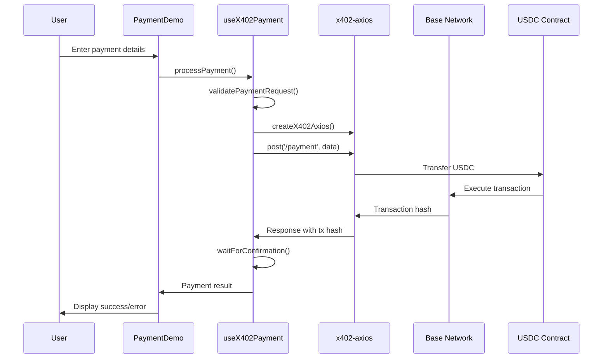

# x402 Payment Integration Documentation

## Overview

This document describes the implementation of x402 payment flow for the Gigs & Gains Guild application. The integration enables seamless USDC payments on the Base network using the x402 protocol with wagmi and OnchainKit.

## Architecture

### Core Components

1. **useX402Payment Hook** (`lib/hooks/useX402Payment.ts`)
   - Main hook for handling x402 payments
   - Integrates with wagmi's `useWalletClient`
   - Provides payment processing, validation, and status management

2. **PaymentDemo Component** (`components/PaymentDemo.tsx`)
   - User interface for testing x402 payments
   - Form validation and user feedback
   - Real-time payment status updates

3. **Test Suite** (`lib/tests/x402-payment.test.ts`)
   - Comprehensive test coverage for payment flows
   - Validation testing, error handling, and end-to-end scenarios

## Implementation Details

### Payment Flow



### Key Features

#### 1. Wallet Integration
- Uses wagmi's `useWalletClient` for wallet connectivity
- Supports Base network (Chain ID: 8453)
- Automatic wallet state management

#### 2. USDC Integration
- Contract Address: `0x833589fCD6eDb6E08f4c7C32D4f71b54bdA02913`
- Proper decimal handling (6 decimals for USDC)
- Amount conversion using `parseUnits` from viem

#### 3. Transaction Confirmation
- Real-time confirmation tracking
- Configurable timeout (default: 60 seconds)
- Block confirmation counting

#### 4. Error Handling
- Comprehensive error catching and reporting
- User-friendly error messages
- Network error resilience

### Code Examples

#### Basic Payment Processing

```typescript
import { useX402Payment } from '@/lib/hooks/useX402Payment';

function PaymentComponent() {
  const { processPayment, status, isConnected } = useX402Payment();

  const handlePayment = async () => {
    const result = await processPayment({
      amount: '10.50',
      recipient: '0x742d35Cc6634C0532925a3b8D4C9db96C4b4d8b6',
      description: 'Payment for services',
    });

    if (result.success) {
      console.log('Payment successful:', result.transactionHash);
    } else {
      console.error('Payment failed:', result.error);
    }
  };

  return (
    <div>
      {isConnected ? (
        <button onClick={handlePayment} disabled={status.isLoading}>
          {status.isLoading ? 'Processing...' : 'Send Payment'}
        </button>
      ) : (
        <p>Please connect your wallet</p>
      )}
    </div>
  );
}
```

#### Payment Validation

```typescript
const { validatePaymentRequest } = useX402Payment();

const paymentRequest = {
  amount: '5.00',
  recipient: '0x742d35Cc6634C0532925a3b8D4C9db96C4b4d8b6',
  description: 'Test payment',
};

const error = validatePaymentRequest(paymentRequest);
if (error) {
  console.error('Validation failed:', error);
} else {
  // Proceed with payment
}
```

## Testing

### Test Coverage

The test suite covers:

1. **Payment Request Validation**
   - Valid payment requests
   - Invalid amounts (zero, negative)
   - Invalid recipient addresses
   - Address format validation

2. **USDC Integration**
   - Correct contract address usage
   - Decimal conversion accuracy
   - Amount formatting

3. **Transaction Confirmation**
   - Successful confirmation tracking
   - Timeout handling
   - Block number calculations

4. **Error Handling**
   - Wallet not connected scenarios
   - Network errors
   - Insufficient balance errors
   - API response errors

5. **End-to-End Flow**
   - Complete payment processing
   - Transaction hash verification
   - Confirmation counting

### Running Tests

```bash
# Install test dependencies
npm install --save-dev jest @types/jest

# Run tests
npm test lib/tests/x402-payment.test.ts
```

## Configuration

### Environment Variables

```env
# OnchainKit API Key (required)
NEXT_PUBLIC_ONCHAINKIT_API_KEY=your_api_key_here

# Optional: Custom RPC endpoint for Base
NEXT_PUBLIC_BASE_RPC_URL=https://mainnet.base.org
```

### Wagmi Configuration

The providers are configured to support Base network:

```typescript
const config = createConfig({
  chains: [base],
  transports: {
    [base.id]: http(),
  },
});
```

## Security Considerations

1. **Input Validation**
   - All payment requests are validated before processing
   - Address format verification
   - Amount bounds checking

2. **Error Handling**
   - Sensitive information is not exposed in error messages
   - Network errors are handled gracefully
   - User feedback is informative but secure

3. **Transaction Safety**
   - Confirmation waiting prevents premature success reporting
   - Transaction hash verification
   - Proper error propagation

## Deployment Checklist

- [ ] Environment variables configured
- [ ] OnchainKit API key set
- [ ] Base network RPC endpoint configured
- [ ] x402-axios package installed
- [ ] Wagmi providers properly configured
- [ ] Test suite passing
- [ ] Error handling tested
- [ ] User interface responsive
- [ ] Transaction confirmation working

## Troubleshooting

### Common Issues

1. **"Wallet not connected" error**
   - Ensure user has connected their wallet
   - Check MiniKit provider configuration
   - Verify wagmi setup

2. **"Invalid recipient address" error**
   - Verify address format (0x prefix, 42 characters)
   - Check for typos in address
   - Ensure address is valid Ethereum address

3. **Transaction timeout**
   - Check Base network status
   - Verify sufficient gas fees
   - Increase timeout if needed

4. **x402-axios errors**
   - Verify package installation
   - Check network connectivity
   - Review API endpoint configuration

### Debug Mode

Enable debug logging by setting:

```typescript
console.log('Processing x402 payment:', paymentData);
```

This will log payment details for debugging purposes.

## Future Enhancements

1. **Balance Checking**
   - Implement USDC balance retrieval
   - Pre-payment balance validation
   - Insufficient funds warnings

2. **Payment History**
   - Store payment records
   - Transaction history display
   - Payment status tracking

3. **Multi-token Support**
   - Support for other ERC-20 tokens
   - Token selection interface
   - Dynamic token configuration

4. **Advanced Features**
   - Recurring payments
   - Payment scheduling
   - Batch payments
   - Payment splitting

## Support

For issues or questions regarding the x402 integration:

1. Check the test suite for expected behavior
2. Review error messages for specific issues
3. Verify wallet and network connectivity
4. Consult the x402-axios documentation
5. Check Base network status

## References

- [x402 Protocol Documentation](https://github.com/x402-protocol)
- [wagmi Documentation](https://wagmi.sh/)
- [OnchainKit Documentation](https://onchainkit.xyz/)
- [Base Network Documentation](https://docs.base.org/)
- [USDC on Base](https://basescan.org/token/0x833589fcd6edb6e08f4c7c32d4f71b54bda02913)
